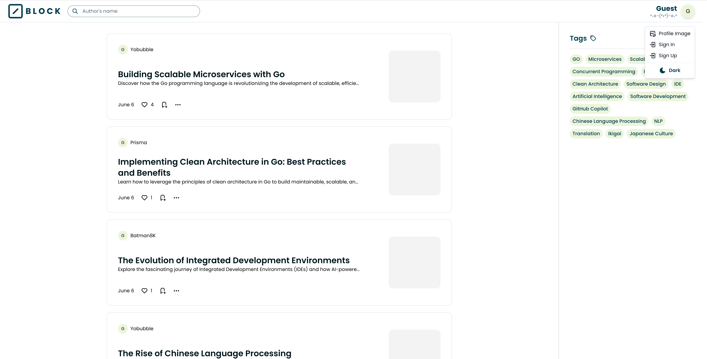

# Blog Web Application (Block)
A simple blog web application inspired by [Medium](https://medium.com).

## Tech Stack
- **Languages Used:** GO, Typescript
- **Frontend Frameworks:** React.js, Next.js, Shadcn/ui, TailwindCSS
- **Backend Frameworks:** GO Fiber, GORM
- **Database:** Postgres (Docker)

### Project Structure
- **Architecture:** Clean Architecture

## Setup Instructions
1. **Run Docker Compose** to start the mock PostgreSQL server.
2. **Customize server and database configuration** (optional):
    ```yaml
    # backend/config.yaml
    app:
      server:
        port: 7070  # server port

    database:
      host: localhost
      port: 5432
      user: myuser  # database user
      password: mypassword  # database password
      dbname: mydb  # database name
      sslmode: disable
    ```

3. **Configure server environment variables** in `.env`:
    - `JWT_SECRET`
    - `SENDER_EMAIL`
    - `GOOGLE_APP_PASSWORD`
4. **Customize mock data** in the migrations folder (note that this is just mock data).

### API Documentation
Find the API documentation on [Postman](https://www.postman.com/altimetry-cosmologist-63308896/workspace/yobubble-s-playground/collection/32957457-a675066f-9852-472c-96e1-dcf85c82791b?action=share&creator=32957457).

## Running the Application
1. Ensure the PostgreSQL container is running.
2. **Backend:**
    ```sh
    cd backend
    go run cmd/block/block.go
    ```
3. **Frontend:**
    ```sh
    cd frontend
    npm install
    npm run dev
    ```

## Features Included
- Create, Read, Update, Delete Blog
- Real-time like count and status
- Sign In, Sign Up with JWT for Authentication and Authorization
- Password Reset (Email Verification Code)
- Profile Search
- Tag Search
- Profile Image Change

## Preview

